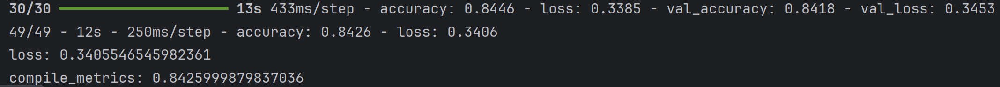

# 使用 TensorFlow Hub 对电影评论进行文本分类
模型最终效果是

可以从截图中看到拟合效果很好不论是这些训练集还是测试集上，置信度均可达到0.84
## 任务内容
这是一个使用预训练模型构建的imdb分类模型，预训练模型为universal-sentence-encoder-tensorflow2-universal-sentence-encoder-v2.tar.gz
目的是使用该预训练模型做预训练文本嵌入向量作为首层，这样做有三个优点：

不必担心文本预处理
可以从迁移学习中受益
嵌入向量具有固定大小，更易于处理
数据加载是使用TF_datasets加载的imdb_reviews数据集，然后将训练集前60%切为训练数据，后40%切为验证数据，使用test作为测试数据
模型的训练步骤为加载数据、加载模型、在CPU上构建hub.KerasLayer以及简单的dense层同时在CPU上编译和训练模型、用测试集评估模型、最后保存模型
## 这个任务学到了
1. 构建模型的方式，这次没有使用Sequential构建，而是尝试函数式API构建模型的方式，原因是Sequential构建模型需要严格按照层要求构建、而函数式API可以构建更灵活的模型
2. 学会使用预训练模型构建新模型，比从头搭建更方便
3. 学会使用CPU训练后GPU训练的操作
4. 由于本任务使用的是tfhub的模型，了解到tfhub模型在文本处理上大多在CPU上，小模型还可以，但想处理更大模型就要使用hugging face的transformer模型，同时知道如果非要
使用tfhub的模型，就要禁用XLA

